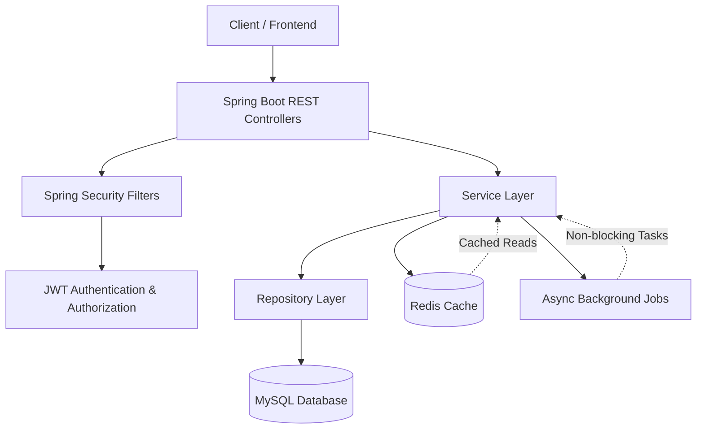

# 🌱 GreenTrack Backend

GreenTrack is a backend system built using **Spring Boot** that enables users to track eco-friendly activities and sustainability goals. The project focuses on **secure authentication**, **clean architecture**, and **scalable REST API design**, following modern backend engineering best practices.

---

## 📌 Project Overview

GreenTrack offers REST APIs for managing users, activities, and goals, ensuring secure access through **JWT-based authentication** and **role-based authorization**.  
The application is designed using a **production-grade layered architecture** to improve maintainability, scalability, and testability.

This project demonstrates real-world backend concepts, including **stateless security**, **pagination**, **caching**, and **asynchronous processing**.

---

## 🛠 Tech Stack

- **Language**: Java  
- **Framework**: Spring Boot  
- **Security**: Spring Security, JWT  
- **Database**: MySQL  
- **Cache**: Redis  
- **ORM**: Spring Data JPA / Hibernate  
- **Build Tool**: Maven  
- **API Style**: RESTful APIs  

---

## ✨ Features

- User registration and login
- JWT-based authentication and authorization
- Role-Based Access Control (RBAC)
- CRUD operations for:
  - Activities
  - Goals
- Pagination and sorting for scalable data retrieval
- Redis caching for read-heavy APIs
- Async background job processing
- Secure API design with validation
- Centralized exception handling
- Clean layered architecture (Controller, Service, Repository)

---

## 🏗 System Architecture

### High-Level Architecture Diagram

